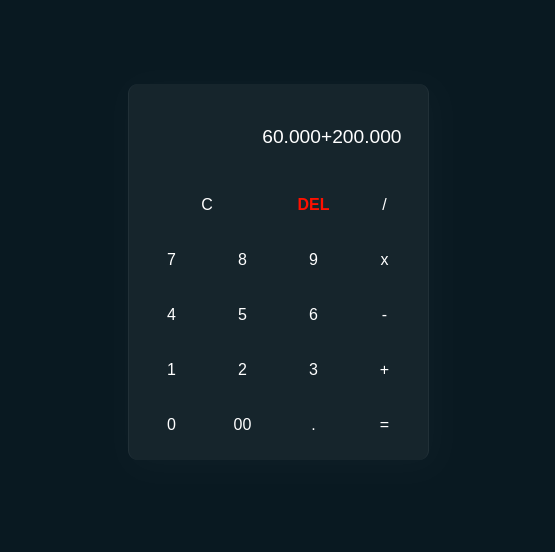

# kalkulator glassmorphism

## perkenalan

ini adalah project yang digunakan untuk mengikuti bootcamp PESILAT di [alkademi.id](https://pesilat.alkademi.id)

## fitur-fitur

- menggunakan notasi titik (.) pada angkanya agar memudahkan pengguna untuk membacanya

- operator hanya bisa di klik jika angkanya ada dan di akhir inputnya harus angka bukan operator lagi, fitur ini memungkinkan untuk mencegah bug pada kalkulator yang di sebabkan tombol operator bisa di klik berulang kali
